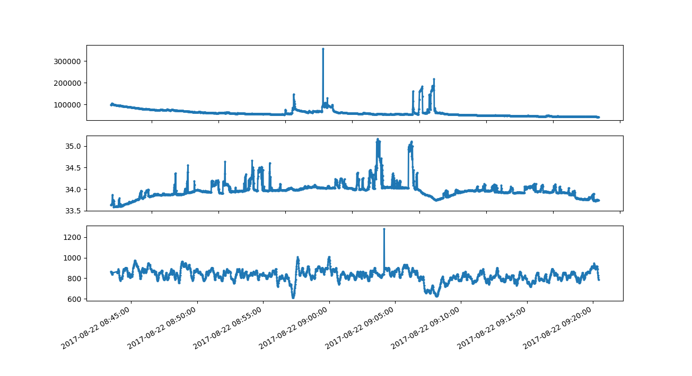

# Headline #
The **Aura** device will alert an user from an epilepsy seizure within few minutes notice.
**Aura data analysis platform** provides a set of tools to easily acces and analyse anonymized patient data.

# Quick Start #

 - install python 3, pip and virtualenv

 - clone the repository

```
        git clone https://github.com/clecoued/Aura_data_analysis_platform.git
```
 - create a new python [virtualenv](http://python-guide-pt-br.readthedocs.io/en/latest/dev/virtualenvs/) in the repository (the -p is not necessary if python 3 is your default version)
```
        cd Aura_data_analysis_platform
        virtualenv myProject -p <pathToPython3>
```
 - install python package dependencies
```
        pip install -r requirements.txt
```
 - get your personnal credentials file *credentials.cfg* and copy it to *Aura_data_analysis_platform/query/credentials.cfg*
 - launch the demo script
```
        cd query
        python queryExample.py
```
 - Success !

# API #
## Database

Data are stored in a two differents databases on Cloud in order to split user personnal information from physiological data.
User physiological data remain completely anonymous and data scientists can only access to user UUID information.

### User data
User data are stored on a **Amazon DynamoDB**(NoSql) database.

We acces it using python Amazon library [boto3](http://boto3.readthedocs.io/en/latest/reference/services/dynamodb.html) 

The database is described as below:

A single table - **Users** - *storing the users list under format:*

```javascript
// User sample
{
    "UUID": "0399a758-da41-4fa5-aa30-625bc19c92ac" //(String) User UUID 
}
```

### Physiological signal data 
Physiological signal data are stored on a **InfluxDB** (Times Series Database) database.

We acces it through:

  - REST API - see [InfluxDB documentation](https://docs.influxdata.com/influxdb/v1.3/guides/querying_data/)
  - [Python InfluxDB client library](https://github.com/influxdata/influxdb-python) wrapping the requests


We store informations in a single table - ** physio_signal ** -

We currently save three differents **measurements**:

  * Heart rate - **heart** -
  * Skin Temperature - **temperature** -
  * Electro Dermal Activity - **electro_dermal_activity** -

Each measurement is tagged with following fields:

|   TAG         | Description            |
|:------------: |:-------------:         |
| uuid          | (String) sample UUID   |
| user          | (String) user UUID *see User data section*      |
| type          | (String) data type */ RrInterval / SkinTemperature / ElectroDermalActivity /*      |
| device_adress | (String) device adress UUID           |
| time          | date and timestamp in milleseconds             |


### Data Viz



